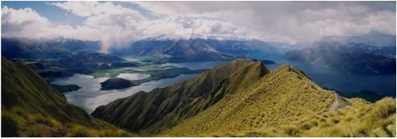
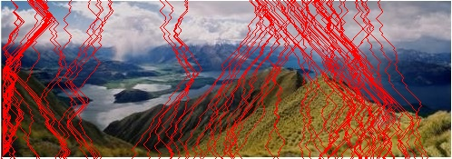
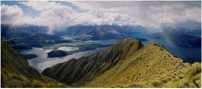

# Seam Carving for Content-Aware Image Resizing

Seam Carving is an image processing technique used for content-aware image resizing. It intelligently removes the least important pixels from an image to reduce its width while preserving the important content.

## 📷 Example Results

### Original Image

### Image with Seams Marked

### Resized Image (After Seam Removal)

### Original Image

### Image with Seams Marked

### Resized Image (After Seam Removal)

---

## 📌 How It Works

1. Convert the image to grayscale.
2. Compute the energy map using Sobel filters.
3. Find the optimal vertical seam to remove using dynamic programming.
4. Remove the seam and repeat until the desired width is achieved.
5. Save each step to visualize the process.
